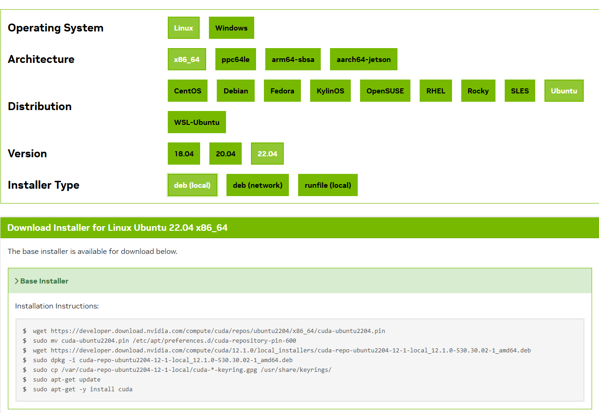

# 配置 CUDA

CUDA 是 NVIDIA 提供的并行计算平台与编程模型，深度学习框架（PyTorch、TensorFlow 等）底层都要依赖 CUDA 才能调用 GPU 算力。装好显卡驱动只是第一步，接着就要按项目需求安装对应版本的 CUDA Toolkit，并配置好路径。

CUDA Toolkit 里最重要的几个组件分别是：`nvcc`（CUDA 编译器，把 `.cu` 代码编译成 GPU 可执行程序）、CUDA 运行时库、以及 cuDNN、TensorRT 这类加速库。`nvcc --version` 显示的是 Toolkit 版本，`nvidia-smi` 显示的是驱动支持的 CUDA 最高版本，两者不是一回事，后面排查时会用到这个区别。

实际工作中我经常遇到不同项目需要不同 CUDA 版本的情况：有的项目要 CUDA 11.8，有的要 12.6。如果每次切换版本都手动改 PATH，很容易改乱，还会出现「`nvcc --version` 是一个版本、运行时库是另一个版本」的错位。所以这篇文章里我重点推荐用 `update-alternatives` 来管理多版本 CUDA——它是 Debian/Ubuntu 官方的版本管理工具，把每个 CUDA 版本注册进去之后，切换版本只需要执行一条交互式命令，符号链接自动指向目标版本，环境变量都不用再动。

## For Linux

### 安装前的检查

在安装 CUDA 之前，先确认硬件、系统、编译器都满足条件。本部分参考[Pre-installation Actions](https://docs.nvidia.com/cuda/archive/12.8.0/cuda-installation-guide-linux/#pre-installation-actions)

```bash
# 验证是否装有支持CUDA的GPU
lspci | grep -i nvidia
# 预期输出：[有输出即可]

# 验证linux系统是否支持
# 注：常用的系统都支持，可跳过检查
uname -m && cat /etc/*release
# 预期输出：
# x86_64 
# Red Hat Enterprise Linux Workstation release 6.0 (Santiago)

# 验证gcc是否安装
gcc --version
```

这三步检查分别对应硬件、系统、编译器三个前提：`lspci | grep -i nvidia` 有输出说明显卡被系统识别；`uname -m` 确认 CPU 架构（深度学习开发常见 x86_64 和 aarch64）；`gcc --version` 确认编译器可用，因为 CUDA 的 `nvcc` 编译 C++ 代码时需要调用 gcc。

如果显卡没被识别，先回到上一篇文章把驱动装好再来；如果 `gcc` 没装，用系统的包管理器装好 `build-essential` 再继续。检查通过后就可以进入安装环节了。

### 安装CUDA

在[CUDA版本列表](https://developer.nvidia.com/cuda-toolkit-archive)查找需要安装的版本，并根据指示选择版本和执行页面内的指令进行安装进行安装。其中`Installer Type`选择为`deb(local)`。

关于版本的选择给一点参考：先看项目要求（比如 PyTorch 官方安装命令里会标明配套的 CUDA 版本），再结合驱动支持的最高 CUDA 版本，选一个两者都满足的即可；没有特殊要求的话，用最新的稳定版就行。

参考案例如：

!!! note "说明"
    `deb(local)` 方式先把 CUDA 的 deb 包下载到本地再安装，安装过程可控、日志清晰，出错也容易清理；不建议用 `runfile` 方式，它容易和系统包管理产生冲突。页面上生成的安装指令会带上具体版本（例如 `cuda-toolkit-12-6`），装完后 `/usr/local` 下会出现对应的 `cuda-12.6` 目录，这正是后面用 `update-alternatives` 注册的对象。

### 安装后的配置

本部分参考[Post-installation Actions](https://docs.nvidia.com/cuda/archive/12.8.0/cuda-installation-guide-linux/#post-installation-actions)

安装完成之后还有三件事要做：装依赖、配置路径、清理冗余包。路径配置是其中最容易出问题的环节，强烈建议直接使用方法二，一步到位。

安装常见的依赖

```bash
sudo apt-get install g++ freeglut3-dev build-essential libx11-dev \
    libxmu-dev libxi-dev libglu1-mesa-dev libfreeimage-dev libglfw3-dev
```

这些依赖大多与 OpenGL、图形渲染相关，编译和运行 CUDA 示例程序时会用到；`build-essential` 则保证编译工具链齐全。如果后续编译某个项目报缺库的错误，多半是这里漏装了某个开发包，按报错提示补装对应依赖即可。

配置路径

- 方法一：通过PATH环境变量指定CUDA版本

```bash
export PATH=/usr/local/cuda-12.6/bin${PATH:+:${PATH}}
```

这种方法最简单，但每次切换版本都要重新设置环境变量，且只对当前终端生效，多版本共存时很容易乱。

- 方法二：通过update-alternatives管理（推荐）

```bash
# 1. 显示当前活动的 CUDA 版本和所有可用版本
update-alternatives --display cuda

# 2. 显示特定主版本的所有可用小版本,如CUDA-12.*
update-alternatives --display cuda-12

# 3. 交互式切换 CUDA 版本
sudo update-alternatives --config cuda

# 再次确认是否切换成功
update-alternatives --display cuda
# 检查当前激活的 CUDA 版本
nvcc --version
# 检查符号链接指向
ls -l /usr/local/cuda

# 如果所安装的CUDA未被update-alternatives识别
# 则需要将 CUDA 版本注册到 alternatives 系统
# 例如，注册 CUDA 12.6，
# /usr/local/cuda：符号链接的位置（系统实际使用的路径）
# cuda：alternatives 系统中的名称
# /usr/local/cuda-11.8：实际的 CUDA 安装路径
# 110：优先级（数字越大优先级越高）
sudo update-alternatives --install /usr/local/cuda cuda /usr/local/cuda-12.6 120
```

`update-alternatives` 的原理是把 `/usr/local/cuda` 做成一个符号链接，通过 `sudo update-alternatives --config cuda` 交互式选择当前要用的版本，优先级（`--install` 命令末尾的数字）越大，默认排得越靠前。需要说明的是，原注释里的 `/usr/local/cuda-11.8` 只是示例路径，实际安装的是哪个版本就注册哪个，命令本身通用。切换后建议同时检查符号链接指向和 `nvcc` 版本，两者一致才算切换成功。

清理冗余的安装包

```bash
sudo apt-get remove --purge "cuda-repo-<distro>-X-Y-local*"
```

查询当前运行的CUDA版本

```bash
nvcc --version
```

## 常见问题

**问：`nvcc --version` 和 `ls -l /usr/local/cuda` 指向的版本不一致怎么办？**

说明符号链接或 PATH 没有同步更新。先用 `ls -l /usr/local/cuda` 确认符号链接指向，再重新执行 `sudo update-alternatives --config cuda` 切换，最后在新开的终端里复查 `nvcc --version`。

**问：项目要用旧版 CUDA（如 11.8），但系统已经装了 12.6，会冲突吗？**

不会。CUDA Toolkit 支持多版本共存，每个版本独立安装在自己的目录（`/usr/local/cuda-11.8`、`/usr/local/cuda-12.6`），互不干扰。需要哪个版本就用 `update-alternatives` 切换过去，这也是我推荐这个方案的原因。

**问：CUDA 装好了，但 PyTorch 提示找不到 CUDA 怎么办？**

CUDA Toolkit 负责编译环境（`nvcc`），运行时还需要 NVIDIA 驱动里的 CUDA 驱动库支持。先确认驱动已装好（`nvidia-smi` 有输出），再确认 PyTorch 版本对应的 CUDA 版本与系统一致。`nvidia-smi` 显示的 CUDA 版本是驱动支持的最高版本，并不代表 Toolkit 装的就是这个版本，两者需要分别确认。

**问：卸载某个 CUDA 版本的正确姿势是什么？**

先 `update-alternatives --display cuda` 确认当前激活的版本不是要卸载的那个，再通过 `dpkg -l | grep cuda` 找出该版本的包列表，用 `sudo apt-get remove --purge` 逐个卸载，最后删除 `/usr/local/cuda-xxx` 目录并重新执行 `sudo update-alternatives --config cuda` 刷新列表。多版本共存时先卸载旧版再装新版，顺序反了容易出问题。

## 写在最后

CUDA 环境的配置本质上就两件事：装对版本、管好路径。版本选择跟着项目走，路径管理用 `update-alternatives`，这两点做到位，后续基本不会再遇到环境问题。我自己的多台机器都是按这个方案管理的，从 CUDA 11.8 到 12.6 之间的切换从来没有出过岔子。

如果你的 CUDA 已经装好、`nvcc --version` 也正常，但框架跑不起来，多半是驱动或框架版本的问题，可以回头看看显卡驱动那篇文章的排查流程。环境问题大多数时候不是「装不上」，而是「版本错位」，先确认每一个组件各自的版本，再谈别的。
